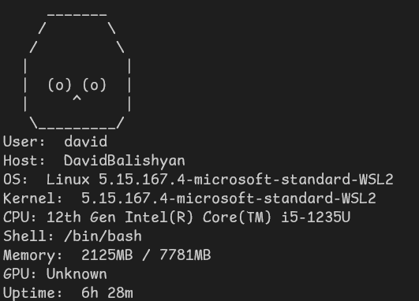
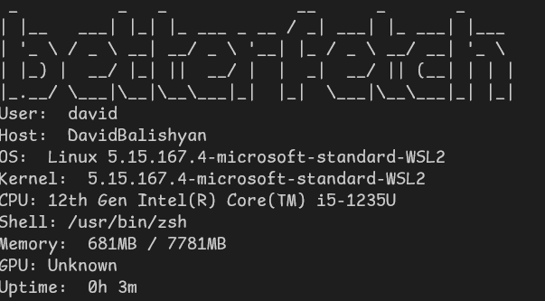

# Betterfetch

 
WARNING!: this app is still in development, there are some bugs.
You can open an issue in github
## This tool is still not for WINDOWS
## LINUX only!!!    
# CMake is not fully working, use the pre-compiled binarys or compile it without cmake
